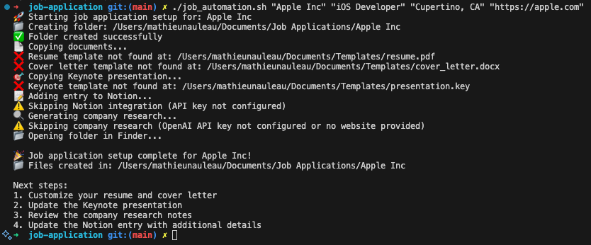

# Job Application script

## Purpose
Applying to a new job has a lot of redundant steps. This project aims to automate some parts of the process so the user can more quickly focus on the preparing the interview.
One command line in the terminal could:
- Create a new folder in a specific location in the Finder (mac) and rename it with the name of a company
- Duplicate a resume and motivation letter into this new folder
- Duplicate a Keynote file into this new folder
- Add a new entry in Notion based on the company name (and add location, position, website etc).
- Generate a text file with company facts and figure, based on a Chat-GPT prompt.

## Scope Clarification
### Easy to implement:
- Creating folders and copying files
- Creating text files
- Basic file organization

### Medium complexity:
- Notion API integration (requires API key and setup)
- Keynote file duplication (works, but Keynote files are complex)

### More complex:
- ChatGPT API integration for company research
- Error handling and input validation

## How It Could Work
A bash script that:
- Takes a company name as input
- Uses macOS command-line tools (mkdir, cp, curl)
- Integrates with APIs (Notion, OpenAI)
- Handles file paths and organization

## Execute the script

```bash 
chmod +x job_automation.sh
./job_automation.sh "Apple Inc" "iOS Developer" "Cupertino, CA" "https://apple.com"
```